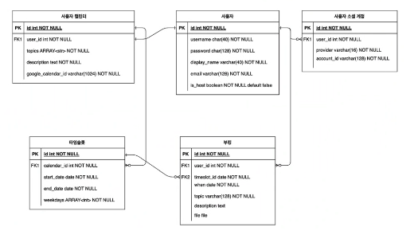

# 서비스 개요
약속 잡기 서비스 
- 주최자가 제공하는 약속 시간대를 손님이 선택하여 약속을 잡는 서비스
- 시간대를 선택하면 약속을 잡을 수 있는 신청 양식이 나타나 예약 신청을 함

# 주요 기능
1. 캘린더 
- 연월 단위로 달력 표기
- 과거로 이동 불가
- 가용 가능한 타음슬롯이 있는지 여부 표기
- 일자 선택 시 타임슬롯 표기

2. 부킹 생성
- 타임슬롯을 선택할 때 가용 가능한지 검사
- 부킹 생성할 때 중복 생성인지 검사
- 일정 기간 이후에는 일정 신청 불가
- 부킹 생성 후 구글 캘린더에 등록

3. 사용자별 캘린더 구분해서 보기

4. 구글 캘린더 연동하기
- 호스트의 구글 캘린더에서 일정 가져오기
- 호스트의 구글 캘린더에 일정관리하기
- 호스트의 구글 캘린더 일정에 게스트 초대하기

5. 소셜 로그인 구현하기

# 화면 설계도
TBO

# 데이터 설계

